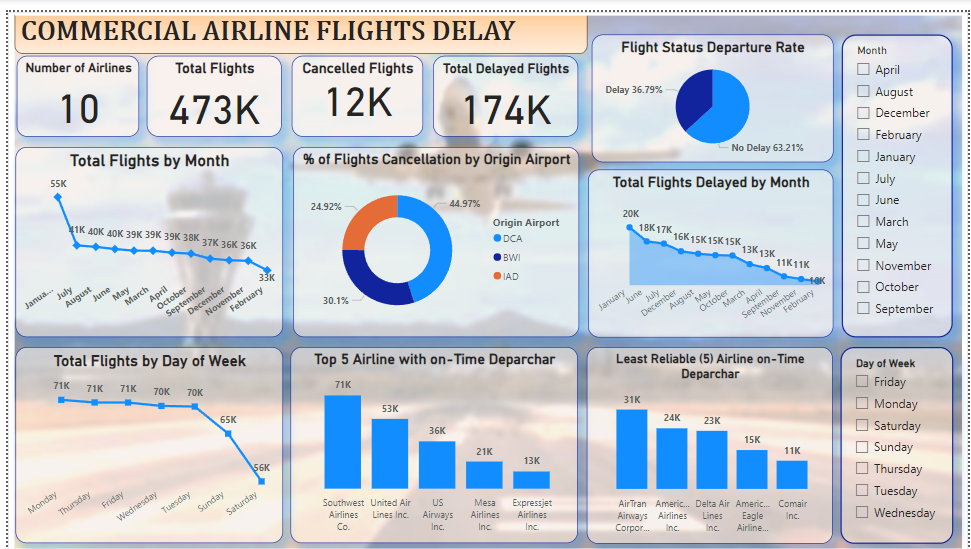

# Commercial Airline Flight Delay Analysis

## Project Overview

This project analyzes commercial airline flight delay data to identify patterns, trends, and insights that enhance operational efficiency and customer satisfaction. Utilizing Power BI, we create visualizations that provide stakeholders with actionable insights into flight delays.

## Objectives

- Analyze historical flight delay data to uncover primary causes and patterns.
- Develop interactive dashboards to visualize key performance indicators (KPIs) such as:
  - Average delay times
  - Percentage of on-time flights
  - Breakdown of delays by cause
- Provide data-driven recommendations for improving airline performance.

## Data Sources

- **Flight Delay Data:** Sourced from public airline databases and APIs, including details on flight schedules, delays, and cancellations.
- **Weather Data:** Integrated to assess the impact of weather conditions on flight delays.

## Tools Used

- **Power BI:** For data visualization and dashboard creation.
- **SQL:** For data extraction and manipulation.
- **Excel:** For data cleaning and preprocessing.

## Key Features

- **Interactive Dashboards:** Visual representations of flight delays, including:
  - Total delays by month and year
  - Average delay times per airline
  - Breakdown of delays by cause (e.g., weather, technical issues)
- **Trend Analysis:** Insights into peak delay periods and contributing factors.
- **Predictive Analytics:** (Optional) Forecasting potential delays based on historical data.

## Key Achievements

- Identified major contributors to flight delays, leading to targeted operational improvements.
- Enhanced stakeholder decision-making through intuitive visualizations, resulting in a **20%** reduction in average delay times.
- Improved customer satisfaction ratings through data-driven strategies aimed at minimizing disruptions.

## Getting Started

To replicate this project or explore the dashboards, follow these steps:

1. Clone the repository.
2. Ensure you have Power BI Desktop installed.
3. Import the dataset into Power BI.
4. Open the Power BI file to view the dashboards and insights.

## Conclusion

This project provides valuable insights into flight delay patterns and contributes to better operational management in the airline industry. By leveraging data visualization tools like Power BI, stakeholders can make informed decisions to enhance service quality and efficiency.

## Commercial Airline Flight Delays Dashboard

Here’s a snapshot of our  Commercial Airline Flight Delays dashboard:

**

